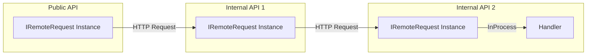

# MediatR.Remote [[한국어](README.ko.md)]

## What is MediatR.Remote?

The MediatR.Remote library is an extension library of the `IMediator` implementation that distributes and relays remote objects.
Inspired by distributed clustering frameworks like [Akka.NET](https://getakka.net/) or [Orleans](https://github.com/dotnet/orleans), how to distribute via messages.

Modern software development starts small, but it becomes more complex and must scale at a rapid pace.
However, although we always develop with scale expansion in mind, sometimes existing architectures become obstacles in designing new architectures.
`MediatR.Remote` is a library designed to remote/distribute Mediator Pattern of `IMediator`.

`MediatR.Remote` means the role of each service based on `Role`.
Each role may be located in one `In-Process` service, or it may be physically distributed,
The focus is on shrinking or expanding the structure.

## Install

```bash
dotnet add package MediatR.Remote

# ASP.NET Core
dotnet add package MediatR.Remote.Extensions.DependencyInjection
```

## Getting Started



### 1. Message Definition

Implement the `IRemoteRequest` interface in your message class.
or `IRemoteNotification`, which requires an implementation of the `IRemoteStreamRequest` interface.

```csharp
public class HelloRemoteRequest : IRequest<HelloResponse>, IRemoteRequest
{
    public HelloRemoteRequest(string message)
    {
        Message = message;
    }

    public string Message { get; }

    public IEnumerable<string> SpanRoles => new[] { "internal-api1", "internal-api2" };
}

public class HelloResponse
{
    public HelloResponse(string message)
    {
        Message = message;
    }

    public string Message { get; }
}
```

### 2. Configuring Services

Define the role of the currently running service through the `AddRemoteMediatR()` method.

If you want to run all roles in one service in one In-Process, `builder.Services.AddRemoteMediatR(new[] {"public-api", "internal-api1", "internal-api2"}, ...);` You can define the role of the service like this:

```csharp
builder.Services.AddMediatR(/* ..omitted.. */);
builder.Services.AddRemoteMediatR("public-api", remoteBuilder =>
{
    remoteBuilder.AddHttpStrategy("public-api", client => client.BaseAddress = new Uri("http://localhost:5000"));
    remoteBuilder.AddHttpStrategy("internal-api1", client => client.BaseAddress = new Uri("http://localhost:5010"));
    remoteBuilder.AddHttpStrategy("internal-api2", client => client.BaseAddress = new Uri("http://localhost:5020"));
});
```

### 3. Applying Middleware

```csharp
// Map endpoint style of .NET 6 or higher.
app.UseRemoteMediatR(mediatorApplicationBuilder => mediatorApplicationBuilder.UseHttpListener());

// Middlewre style of .NET 5 or older.
app.UseRouting(); // <-- Routing middleware is required
app.UseRemoteMediatR(mediatorApplicationBuilder => mediatorApplicationBuilder.UseHttpListener());
```

### 4. Send Message

```csharp
class Test
{
    private IRemoteMediator mediator; // or private IMediator mediator;

    public Test(IRemoteMediator mediator)
    {
        _mediator = mediator;
    }
    
    public async Task Call()
    {
        var request = new HelloRemoteRequest("HELLO WORLD");
        var response = await _mediator.Send(request);
    }
}
```

## More Communication Strategies

### HTTP

```csharp
// Configure Service
services.AddRemoteMediatR("public-api", remoteBuilder =>
{
    remoteBuilder.AddHttpStrategy("internal-api1", client => client.BaseAddress = new Uri("http://localhost:5010"));
});

// Configure Middleware
app.UseRemoteMediatR(routeBuilder => routeBuilder.MapHttpListener().AllowAnonymous());
```

### gRPC

Experimental feature

```csharp
// Define Custom IMediator Interface
public interface IGrpcMediator : IRemoteMediator;

public class GrpcMediator(IMediator mediator) : RemoteMediator(mediator), IGrpcMediator
{
    public override string ProtocolName => "grpc";
}


// Configure Service
services.AddGrpc();
services.AddRemoteMediatR<IGrpcMediator, GrpcMediator>("public-api", "grpc", remoteBuilder =>
{
    remoteBuilder.AddGrpcStrategy("internal-api1", client => client.Address = new Uri("http://localhost:5011"));
});

// Configure Middleware
app.UseRemoteMediatR(applicationBuilder => applicationBuilder.UseGrpcListener());
```

## More Examples

* [Message Communication Example](examples)
