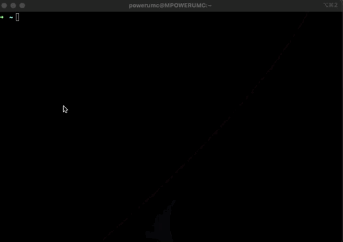

## Run

```bash
docker compose up --build
```

## HTTP Tests

### Test `IRequest`

```bash
curl http://localhost:5000/http/request

# Response
{"message":"OK - HELLO REQUEST"}
```

### Test `INotification`
```bash
curl http://localhost:5000/http/notification

# No Response
# Print on Internal2 console
HELLO NOTIFICATION
```

## Test `IStreamRequest`

It works like an `IAsyncEnumerable<T>`.
```bash
curl -N http://localhost:5000/http/stream

[{"message":"OK - HELLO STREAM 0"},{"message":"OK - HELLO STREAM 1"},{"message":"OK - HELLO STREAM 2"},{"message":"OK - HELLO STREAM 3"},{"message":"OK - HELLO STREAM 4"},{"message":"OK - HELLO STREAM 5"},{"message":"OK - HELLO STREAM 6"},{"message":"OK - HELLO STREAM 7"},{"message":"OK - HELLO STREAM 8"},{"message":"OK - HELLO STREAM 9"}]
```


## gRPC Tests

```
curl http://localhost:5000/grpc/request
curl http://localhost:5000/grpc/notification
curl -N http://localhost:5000/grpc/stream
```